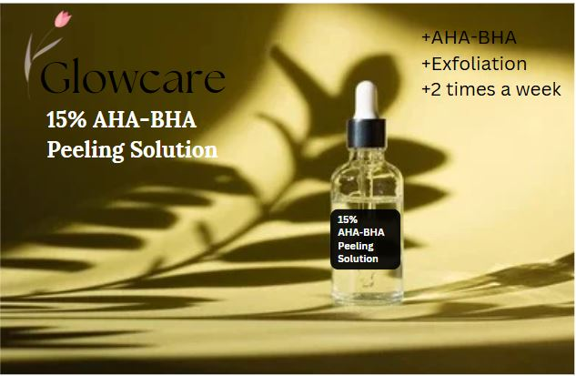

# Glow care a Skincare Recommender System Based on Skin Problem Using Content-Based Filtering  

 

 
Nowadays, skin care is becoming one of the most essential things in our lives. Skincare products have grown rapidly everywhere and tend to increase year by year. So do not be surprised if there are so many skin care products circulating in the community. However, the large number of product choices makes it difficult for people to choose the product that best suits their facial needs. Therefore, the author took the initiative to create a system that is able to recommend skin care products based on facial skin problems. In this study, the author uses the method of content-based filtering in making the recommendation system. This recommendation system is made without using rating data, so the algorithm approach used is cosine similarity and TF-IDF in finding similarity features. Then, the first output that appears will be used by the machine as historical data to then enter the content-based filtering stage. So, users will get recommendations according to the selected keywords and similar products.   
 

 
This website uses datasets scraped independently from various skincare product websites with details:  
  

| Feature Name | Description | 
| --- | --- | 
|**product_href** | Product URL link |
|**product_name** | Product name |
|**product_type** |Type of product (Facial wash, Toner, Serum, Moisturizer, Sunscreen) |
|**brand** | Product brand |
|**notable_effects** | What it's good for |
|**skin type** | The suitable type of skin for the product (Normal, Dry, Oily, Combination, Sensitive) |
|**price** | Product price (in IDR Rp) |
|**description** | Product description |
|**picture_src** | Product image URL link |

# Data Overview  

1. In total, there are 1224 products scrapped from websites.  
2. Because this data was scrapped and arranged by me, it looks neater and cleaner. There's no null value.  
3. Unfortunately, there are 14 duplicate rows. Need to be removed.  
4. Of 5 types of products, serum is more hype than others.   
5. From many pairs of notable effects, 150 products are good for pore care, brightening, and anti-aging all in one product.  
6. Looks like many skin care products suitable for oily skin.

# App  
This project has been deployed using Streamlit. Please visit the link here https://skin-care-recommender-system-141.streamlit.app/.  
App in overall  
 

 

----

 
-----

 

Thank You!
